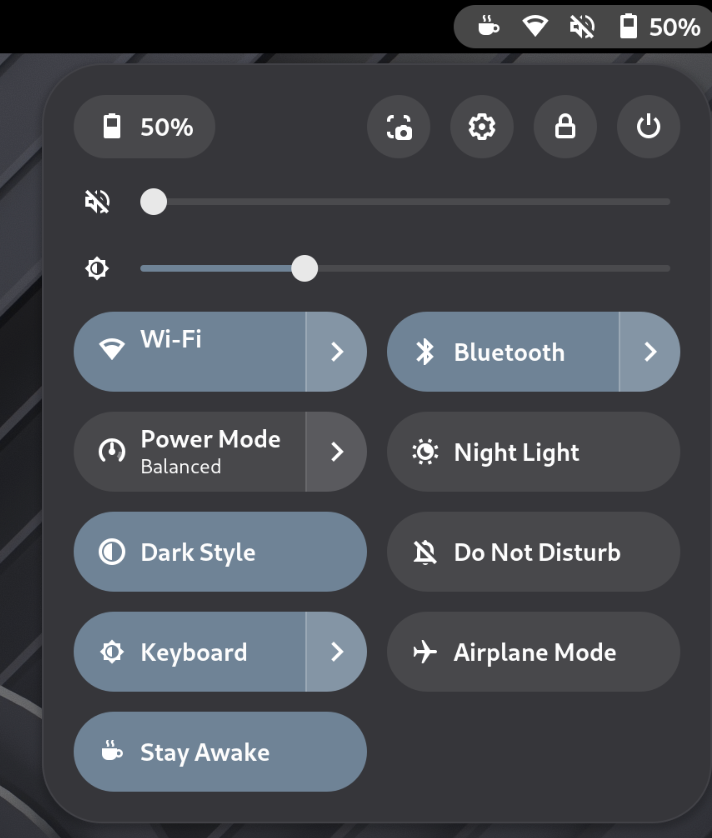

# nosleep

Tell the machine to stay awake.

A GNOME Quick Settings toggle and a CLI that block suspend and lid-switch
sleep. Both drive the same transient systemd user unit, so they can never
disagree about whether the machine is allowed to sleep.

<p align="center">
  
</p>

## Why another Caffeine?

State. Most keep-awake tools hold the inhibitor inside their own process or
track it in settings, and the two drift apart: a stale toggle, a lost
inhibitor after a shell restart, a lock that outlives the session.

nosleep keeps no state at all. Turning it on creates a transient systemd
user unit (`nosleep.service`) that holds a `systemd-inhibit` block lock on
sleep and lid-close. The unit **is** the state:

- The toggle and indicator mirror the real unit over D-Bus, so they cannot
  desync, even across `gnome-shell` restarts.
- The unit dies on logout/reboot, so normal sleep behavior always comes
  back on its own.
- Anything can inspect or stop it: `systemctl --user status nosleep`.
- The CLI and the extension are interchangeable: either can stop what the
  other started, and the toggle lights up when a script enables it.

**Scope.** *Stay Awake* blocks *sleep* (suspend and lid-close), not *idle* —
it keeps the machine running through a download or a long job, but the screen
may still blank and lock. The extension adds a second, independent *Keep
Screen On* toggle that also blocks GNOME idle, so the screen never blanks: a
presentation mode. Use either, or both — block sleep but let the screen lock
for security, or keep everything awake. The CLI drives *Stay Awake* only.

## CLI

```
nosleep            # toggle
nosleep 2h         # stay awake for 2 hours (also: 90m, 45s, 1d)
nosleep on         # stay awake until turned off
nosleep off
nosleep status
```

Requires only `bash` and systemd. Install by dropping `bin/nosleep` on your
`PATH`, or on Nix:

```
nix run github:ilyasturki/nosleep
```

## GNOME extension

Two Quick Settings toggles — "Stay Awake" (blocks suspend and lid-switch
sleep) and "Keep Screen On" (blocks GNOME idle so the screen never blanks) —
with a top-bar indicator while either is active. Both stay on the lock
screen, so you can confirm or flip stay-awake without unlocking. Supports
GNOME Shell 45 to 50.

- From [extensions.gnome.org](https://extensions.gnome.org/extension/10230/nosleep/)
- Manual: `make install`, then re-log and enable with
  `gnome-extensions enable nosleep@ilyasturki.com`

### NixOS / home-manager

```nix
inputs.nosleep.url = "github:ilyasturki/nosleep";
```

```nix
home.packages = [
  inputs.nosleep.packages.${system}.default    # CLI
  inputs.nosleep.packages.${system}.extension  # GNOME extension
];
```

## License

GPL-2.0-or-later
